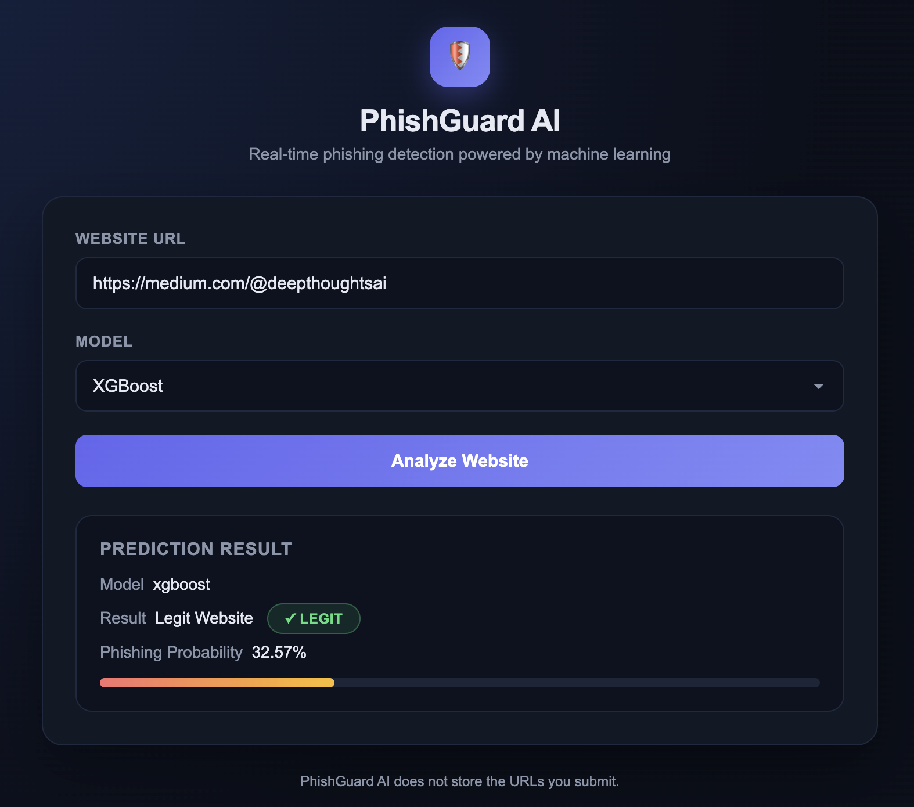
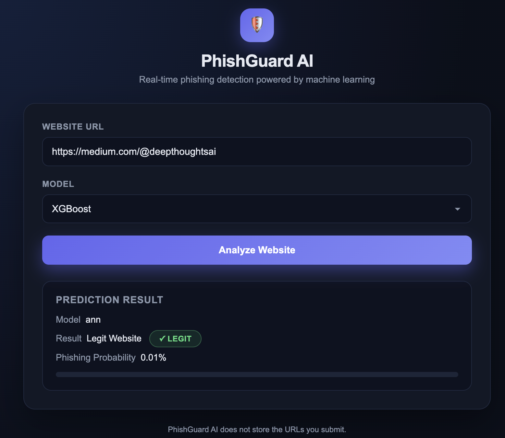
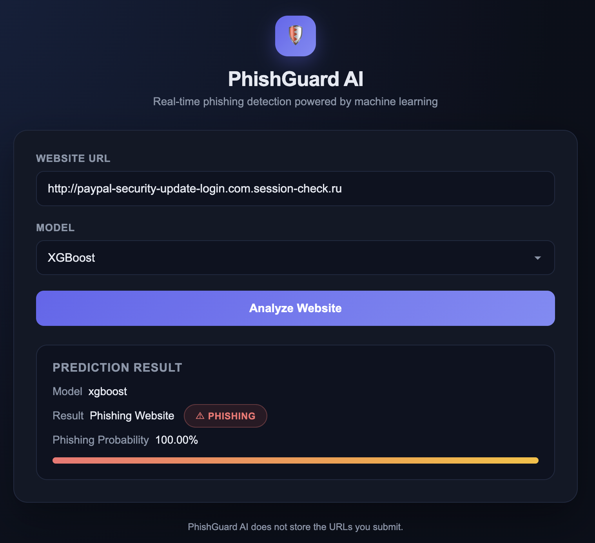

# Phishing URL Detection System  
### End-to-End Machine Learning & MLOps Framework  
#### Real-time Malicious URL Classification

---

## 🚀 Business Impact
Phishing attacks pose a significant threat to digital security, leading to financial loss and data breaches. Detecting malicious URLs is critical for protecting users and organizations.

- Enhances cybersecurity by detecting malicious websites  
- Reduces risk of data breaches and financial fraud  
- Improves user trust in online platforms  
- Enables real-time threat detection  

---

## 🎯 Objective
Build an end-to-end machine learning system that classifies URLs as **phishing or legitimate**, integrating feature engineering, model prediction, and deployment pipelines.

---

## 🧠 Methodology
- Data collection of phishing and legitimate URLs  
- URL-based feature extraction (length, symbols, domain properties)  
- Rule-based filtering for suspicious patterns  
- Model training using ANN and XGBoost  
- Pipeline: `URL → Feature Extraction → Rule Validation → Prediction`  
- Evaluation using accuracy, precision, recall, F1-score  

---

## 🛠 Tech Stack
- **Language:** Python  
- **Libraries:** Pandas, NumPy, Scikit-learn  
- **Models:** Artificial Neural Network (ANN), XGBoost  
- **MLOps:** GitHub Actions (CI/CD), Docker  
- **Cloud:** AWS ECS, AWS ECR  

---

## 📊 Results
- High classification accuracy achieved  
- Real-time URL classification enabled  

---

## 📸 Model Performance Screenshots

<table>
  <tr>
    <td align="center">
      <b>XGB (Legit)</b> 
      
    </td>
    <td align="center">
      <b>ANN (Legit)</b> 
      
    </td>
  </tr>

  <tr>
    <td align="center">
      <b>XGB (Phishing)</b> 
      
    </td>
    <td align="center">
      <b>ANN (Phishing)</b> 
      
    </td>
  </tr>
</table>

---

## ⚠️ Challenges
- Feature extraction from unstructured URL data  
- Adapting to evolving phishing techniques  

---

## 🔮 Future Scope
- Integrate deep learning models (LSTM, CNN)  
- Extend to email and SMS phishing detection  

---

© 2026 Ankita Shelke. All rights reserved.
